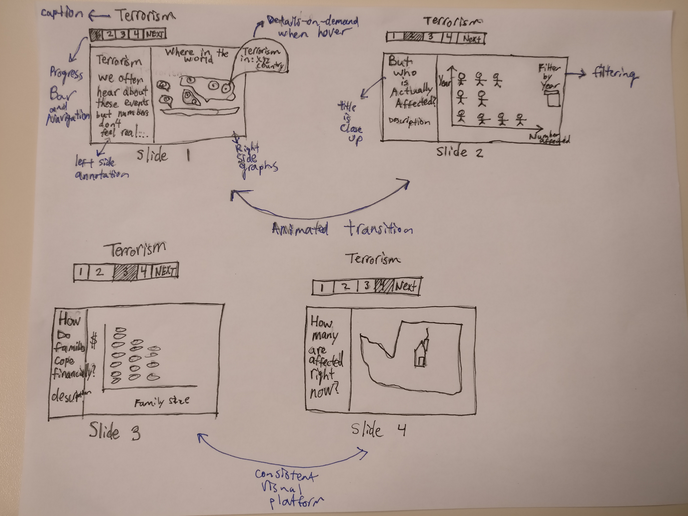

# Slideshow

## Visual Narrative
**Consistent Visual Platform**
> For each slide, I used a consistent layout of annotations on the left side, and graph on the right hand side. I included this because this gives the user a common platform to view the information, and the user will grow accustomed to which parts of the slide will change (so they don't waste time). While this doesn't amplify interpretation in any large way, I do believe this consistent layout will help lead to a predictable structure that the will enhance the user's experience.

**Progress Bar/Timebar**
> The progress bar is incorporated so that the user knows how much the presentation they have already passed, and how much is left. This progress bar also allows users to know how to start the presentation, and move to the next one.

**Close-ups**
>All the close-ups are titles for each slide. This larger font is used to bring the user's attention to that keyword, since it is the encompassing topic for that slide.

**Animated Transitions**
>These occur between slides in which the chart types change. These transitions make the changes explicit so the user isn't confused when the structure of the chart changes.

## Narrative Structure
**Linear**
>As with any other slide show, the progression of mine is linear. A slide show should only show one thing at a time, to overwhelming the user with information, and should also have a logical flow.

**Hover Details**
> I incorportated hover details so that users can see more details only on the data points they are interested in. This allows me to include more data in a certain visualization, since users can 'explore' the points of interest to learn more.

**Filter**
> With filters, I allow the user to have more freedom based on what they want to see. Using this filter, I can allow users to see selectively choose data based on a certain factor (in this case, year), and learn more while keeping all other variables constant.

**Navigation**
>This is included so that a user can move on to the next slide, or skip around. That way, the user can go back to a slide they had previously seen to look at it in more detail, or skip ahead to a particular slide (saves them time) - this way they aren't restricted by a step-by-step process.

**Captions**
> I incorrectly labeled this in my picture, but the picture supposed to be the name of each slide. The purpose of this caption is to set the topic for the entire slide - an overencompassing theme for what is to come. That way, the user knows how to categorize all the following information.

**Annotations**
> The annotations here are used to describe the topic listed on each slide. This is the 'bread and butter' of the slide; the annotations provide the context and the background knowledge through which to understand the visualization on the right.